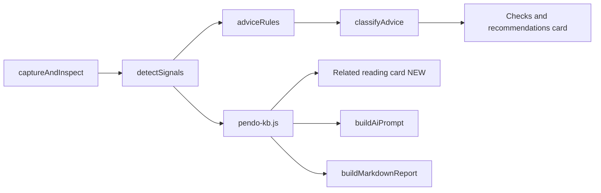

# Broaden support-based advice

Bundle a curated knowledge base of support.pendo.io install articles, then use it additively in three places: more rule-based advice items, a new Related reading card on Status, and richer AI prompt context. No existing checks, links, advice items, UI elements, exports, or tests are removed.

## Design choices (defaults)

- Source: bundled curated JSON in `extension/pendo-kb.js`. Matches the project's existing "bundle everything locally" pattern (`vendor/pendo.js`, local fonts); no build step, no new host permissions, no runtime fetches to support.pendo.io.
- Consumption: rule-based advice expansion AND AI prompt enrichment, both feeding off the same KB.
- All additive. Each existing advice item, link, check, card, severity rule, report section, and test assertion continues to work unchanged.

## Architecture

## Implementation order

| # | Todo ID | Description |
|---|---------|-------------|
| 1 | `kb_file` | Add `extension/pendo-kb.js` with ~20-25 curated support.pendo.io install articles plus `findKbByTopics` helper. Also add `tests/pendoKb.test.js` covering `findKbByTopics` only. |
| 2 | `manifest_resources` | Expose `pendo-kb.js` via `web_accessible_resources` in `manifest.json`. |
| 3 | `kb_script_wire` | Add `` before `popup.js`, and exposed via `extension/manifest.json` `web_accessible_resources`.

### Change: `extension/popup.js`

- Extend `PENDO_SUPPORT` and `SUPPORT_LABELS` with new keys for added signals (e.g. `launcherInstall`, `gtm`, `iframe`, `frameworkSpa`, `agentDebug`, `troubleshooting`, `sandbox`). All existing keys retained.
- Extend `normalizeAdviceList` to also accept an optional `supportKeys: string[]` array on an advice item. First entry remains the primary `supportUrl` (current rendering unchanged); extras become a new `relatedSupportUrls: [{url,label}]` field on the normalized item.
- Extend the inline rule-based mapper inside `captureAndInspect`/`runInPage` with new detection signals, each pushing an additional advice item (no existing items modified):
  - SPA framework hints from `window.React`, `window.Vue`, `window.angular`, `window.next`, `window.__NUXT__`, or numerous `pushState` Pendo resource hits.
  - GTM/Tealium presence from `window.google_tag_manager`/`window.utag` or `googletagmanager.com` in CSP.
  - Iframe context: `window.top !== window` in active tab.
  - Snippet placement: Pendo agent script appearing after first paint via PerformanceResourceTiming.
  - Agent version older than a configurable floor in `pendo-kb.js`.
  - Sandbox/staging hosts (URL hostname matches `/staging|preview|dev\.|qa\./`).
  - Missing `data.pendo.io` in observed resource hits while snippet present.
  - Account metadata empty while visitor metadata populated.
- Add a `selectRelatedReading(signals)` helper that maps detected signals to KB topics and calls `findKbByTopics`.
- Enrich `buildAiPrompt`: append a "Reference excerpts from official Pendo documentation" block listing up to 6 selected KB entries (title, URL, 2-4 bullets), capped at ~800 chars.
- Extend `buildMarkdownReport` to add an additive `## Related reading` section after `## Advice`. Existing sections untouched.

### Change: `extension/popup.html`

Add a new `#relatedReadingCard` (initially hidden) on the Status panel between `#checksCard` and `#identityCard`, plus a script tag for `pendo-kb.js` before `popup.js`. Add a render hook in `popup.js` after `renderCheckGroups` to populate the card with up to 6 deduped links from `selectRelatedReading`.

### Change: `extension/manifest.json`

Add `pendo-kb.js` to `web_accessible_resources`.

### Tests: folded into each implementation todo (not deferred)

`tests/helpers.js` is a verbatim mirror of pure functions from `extension/popup.js` ("Keep these in sync when popup.js changes"), and Vitest coverage targets the helpers file. Helper mirrors must land in the same commit as the matching `popup.js` change, otherwise intermediate commits break `npm test`.

### Change: `CLAUDE.md`

Document the new `extension/pendo-kb.js` knowledge base and the related-reading + AI-prompt-enrichment subsystems in the "Key Subsystems" table and the "Architecture" section.

## Non-goals (explicit)

- No removal or renaming of existing `PENDO_SUPPORT` keys, advice strings, severity rules, cards, exports, or report sections.
- No live fetching from support.pendo.io at runtime (would require new host permissions and adds brittleness).
- No change to AI providers or to the "no key configured" graceful degradation path.

## Open questions to flag during review

- Exact KB article list and which topics each maps to: a first-pass curated list will be included in `pendo-kb.js`. Easy to extend.
- Severity mapping for new advice items: by default everything new lands in `warn`; only items tagged with existing `ERR_SUPPORT_KEYS` continue to be errors.
