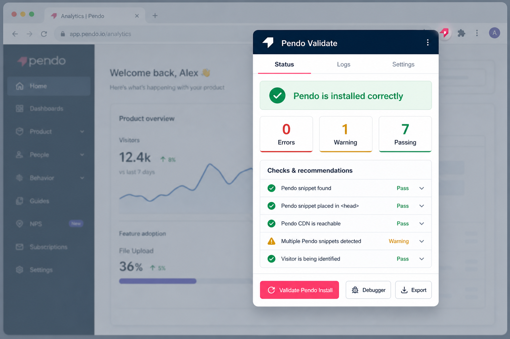
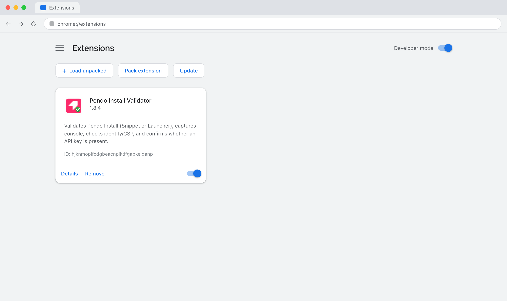
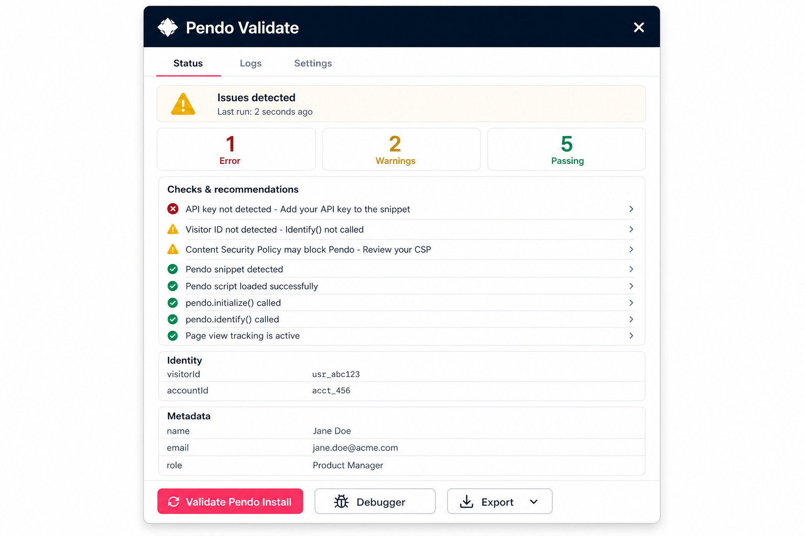

  

<h1 align="center">Pendo Validate Install</h1>

  A browser extension for Chrome, Edge, and Firefox that tells you in one click whether Pendo is installed correctly&nbsp;&mdash; and what to fix if it isn't.

  
  
  
  
  

<!-- Mockup — replace with a real Chrome capture when available. See docs/screenshots/README.md -->

  

---

## The problem

Debugging a Pendo installation today means juggling browser DevTools, running `pendo.validateInstall()` by hand, guessing whether the snippet or the Pendo Launcher loaded, hunting for a missing API key, and cross-referencing CSP headers — all before you can even tell whether visitor identity is flowing. This extension collapses all of that into a single button click. One codebase ships to Chrome, Edge, and Firefox — grab the zip for your browser from [Releases](../../releases).

## Why you'll like it

- **One click, three-phase detection** — finds the Pendo agent whether it comes from a snippet on the page, the Pendo Launcher injecting into the same tab, or a Launcher running in a separate tab.
- **Identity and metadata at a glance** — reads `visitorId`, `accountId`, and visitor/account metadata fields directly from the agent state.
- **CSP and API key checks** — flags missing Pendo domains in `Content-Security-Policy` meta tags and confirms whether an API key is present.
- **Curated support links** — every validation surfaces a *Related reading* card with hand-picked entries from a built-in knowledge base of 25 Pendo support articles.
- **Extended page signals** — detects iframe / sandbox embedding, Google Tag Manager, common SPA frameworks (React / Vue / Angular / Next / Nuxt), the bundled Pendo agent version, and URL sanitization that can strip Pendo's Visual Design Studio token — both load-time redirects and client-side logic (inline-script scan plus history-API instrumentation).
- **Light / Dark / System theme.** Theme selector in Settings persists locally and applies before first paint, so there's no flash of unstyled content.
- **Shareable results** — export a Markdown report with support links and related reading, or copy a Slack-ready summary to your clipboard.
- **Optional AI remediation** — get fix-it suggestions from OpenAI, Anthropic Claude, or Google Gemini. Prompts are enriched with up to 6 KB excerpts so the advice is grounded in official Pendo guidance.

---

## Install in 30 seconds

<!-- Mockup — replace with a real Chrome capture. See docs/screenshots/README.md -->

  

Download the zip for your browser from the [latest GitHub Release](../../releases/latest) — one file per target:

| Browser | Release file | Install steps |
|---|---|---|
| **Chrome** | `pendo-validate-install-<version>-chrome.zip` | Unzip, open `chrome://extensions`, enable **Developer mode** (top-right toggle), click **Load unpacked**, select the unzipped folder. |
| **Edge** | `pendo-validate-install-<version>-edge.zip` | Unzip, open `edge://extensions`, enable **Developer mode** (bottom-left toggle), click **Load unpacked**, select the unzipped folder. |
| **Firefox** (128+) | `pendo-validate-install-<version>-firefox.zip` | Open `about:debugging#/runtime/this-firefox`, click **Load Temporary Add-on…**, select the zip (no need to unzip). |

Then pin the extension icon in the toolbar for quick access.

> **Firefox note:** the zip is unsigned, so Firefox loads it as a *temporary* add-on that is removed when the browser restarts — just reload it from `about:debugging`. A permanent install requires Mozilla (AMO) signing. The Firefox build also omits the `@pendo.io` profile-email identification feature (Firefox has no `identity.email` API), falling back to an anonymous UUID.

**From source** (Chrome / Edge): clone this repo and **Load unpacked** → select the `extension/` folder directly. To apply code changes after editing: click the refresh icon on the extension card, then click the toolbar icon to reopen the panel. For Firefox, build first (`npm install && npm run build:firefox`) since the source manifest is Chrome-flavoured.

---

## Use it

1. Navigate to the page where Pendo should be present.
2. Click the extension icon in the toolbar — a floating, draggable, resizable panel appears on the page.
3. Hit **Validate Pendo Install**.

<!-- Mockup — replace with a real Chrome capture. See docs/screenshots/README.md -->

  

The panel has three tabs:

| Tab | What you'll find |
|-----|-----------------|
| **Status** | Pass/warn/error hero, quick stats (Errors / Warnings / Passing), prioritised checks & recommendations, *Related reading* (curated Pendo KB links), identity, and metadata cards. |
| **Logs** | Colour-coded captured console output with level filter chips (Err / Warn / Info), text search, one-click copy, and a Page facts panel. |
| **Settings** | Appearance (System / Light / Dark theme), page snapshot summary, and AI advice configuration (provider picker, API key with show/hide toggle, save). |

The action bar at the bottom gives you **Validate Pendo Install**, **Debugger** (`pendo.enableDebugging()`), and **Export** (Markdown report or Copy summary).

---

## Optional: AI advice

1. Open **Settings** and pick a provider — OpenAI (`gpt-4o-mini`), Anthropic Claude (`claude-haiku-4-5`), or Google Gemini (`gemini-3.5-flash`).
2. Paste your API key (use the **Show / Hide** toggle to confirm it) and click **Save**.
3. Re-run validation — when warnings or errors are found, the extension requests AI-powered remediation advice grounded in official Pendo sources, with up to 6 curated KB excerpts injected into the prompt for context.

Your key is stored locally in `chrome.storage.local` and is only sent when validation surfaces an issue.

> **Claude behind a corporate policy?** Some orgs disable client-side Anthropic API access. If Claude returns a policy error, switch to OpenAI / Gemini, or point `aiClaudeEndpoint` (in `chrome.storage.local`) at your own HTTPS proxy that forwards to `https://api.anthropic.com/v1/messages`.

---

## Your data stays yours

- **AI is opt-in only.** Calls happen only when you've saved a key, only after validation finds a problem, and only the page URL, agent metadata, and up to 30 captured log lines are sent. Logs may contain user IDs or application details — use the feature only on pages where you're comfortable sharing that context.

---

## For developers

- Release notes — see [CHANGELOG.md](CHANGELOG.md).
- Run the test suite: `npm install && npm test` (Vitest + jsdom, 496 tests across 21 suites).
- Build the release zips: `npm run build` (all three browsers) or `npm run build:chrome` / `build:edge` / `build:firefox`. Output lands in `dist/`; the per-browser manifest transforms live in `scripts/browser-targets.mjs`.
- Releases are automated: pushing a `v*` tag runs tests, builds all three zips, and attaches them to a GitHub Release (`.github/workflows/release.yml`). The tagged commit must be on `Stable` — the workflow verifies this and fails fast otherwise — so merge to `Stable` first, then tag that commit (`git tag v1.8.2 && git push origin v1.8.2`).
- UI element / `data-action` reference — see [extension/popup-actions.md](extension/popup-actions.md).

---

  v1.8.2 &middot; Manifest V3 &middot; Chrome + Edge + Firefox &middot; Built with the Pendo Web SDK

