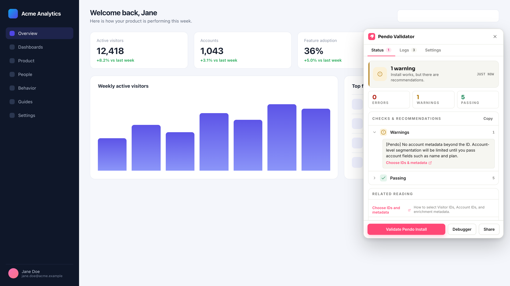
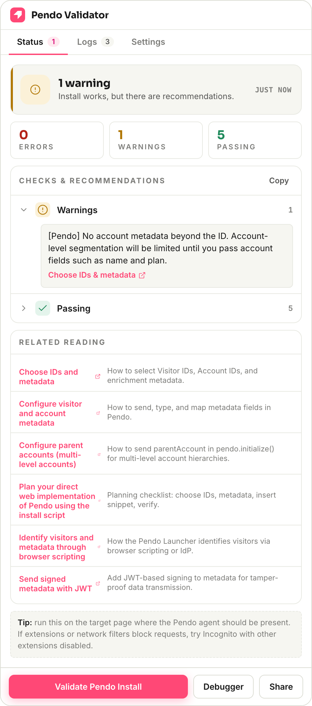

  

<h1 align="center">Pendo Install Validator</h1>

  A browser extension for Chrome and Edge that tells you in one click whether Pendo is installed correctly&nbsp;&mdash; and what to fix if it isn't.

  
  
  
  

  

---

## The problem

Debugging a Pendo installation today means juggling browser DevTools, running `pendo.validateInstall()` by hand, guessing whether the snippet or the Pendo Launcher loaded, hunting for a missing API key, and cross-referencing CSP headers — all before you can even tell whether visitor identity is flowing. This extension collapses all of that into a single button click. Install from the [Chrome Web Store](https://chromewebstore.google.com/detail/Pendo%20Install%20Validator/ihcmfkfdfpoiadcpleapkjeppmephpfa) on Chrome or Edge.

## Why you'll like it

- **One click, three-phase detection** — finds the Pendo agent whether it comes from a snippet on the page, the Pendo Launcher injecting into the same tab, or a Launcher running in a separate tab.
- **Identity and metadata at a glance** — reads `visitorId`, `accountId`, and visitor/account metadata fields directly from the agent state.
- **CSP and API key checks** — flags missing Pendo domains in `Content-Security-Policy` meta tags and confirms whether an API key is present.
- **Deeper install checks on every Validate** — runs the page agent's own `validateEnvironment()` (errors the agent has logged, built-ins such as `JSON.stringify` replaced by the page, and **non-default config options** from the agent's Validate Config audit — snippet vs hosted config vs `window.pendo`), flags an agent script included more than once or agents for more than one API key, spots anonymous `_PENDO_T_` visitors, and maps every frame on the page to show where Pendo is running — including installs that live only in a subframe.
- **Optional network capture (Chrome / Edge)** — turn it on in Settings and **Validate** reloads the page to record which Pendo requests succeed or are blocked (CSP, ad blockers, HTTP errors), plus the page's CSP response header. The capture also backs the Logs → **HAR** download without a second reload.
- **Curated support links** — every validation surfaces a *Related reading* card with hand-picked entries from a built-in knowledge base of 32 Pendo support articles.
- **Extended page signals** — detects iframe / sandbox embedding, Google Tag Manager, common SPA frameworks (React / Vue / Angular / Next / Nuxt), the bundled Pendo agent version, and URL sanitization that can strip Pendo's Visual Design Studio token — both load-time redirects and client-side logic (inline-script scan plus history-API instrumentation).
- **Light / Dark / System theme.** Theme selector in Settings persists locally and applies before first paint, so there's no flash of unstyled content.
- **Shareable results** — export a Markdown report with support links and related reading, or copy a Slack-ready summary to your clipboard.
- **Optional AI remediation** — get fix-it suggestions from OpenAI, Anthropic Claude, or Google Gemini. Prompts are enriched with up to 6 KB excerpts so the advice is grounded in official Pendo guidance.

---

## Install in 30 seconds

**Chrome:** [Add Pendo Install Validator from the Chrome Web Store](https://chromewebstore.google.com/detail/Pendo%20Install%20Validator/ihcmfkfdfpoiadcpleapkjeppmephpfa) — click **Add to Chrome**, then pin the toolbar icon. Updates arrive automatically.

| Browser | Install |
|---|---|
| **Chrome** | [Chrome Web Store listing](https://chromewebstore.google.com/detail/Pendo%20Install%20Validator/ihcmfkfdfpoiadcpleapkjeppmephpfa) — **Add to Chrome**. |
| **Edge** | Open `edge://extensions`, turn on **Allow extensions from other stores**, then use the same [Chrome Web Store listing](https://chromewebstore.google.com/detail/Pendo%20Install%20Validator/ihcmfkfdfpoiadcpleapkjeppmephpfa). Updates arrive automatically. |

> **Firefox:** this extension no longer ships a Firefox build. The last release is [`pendo-validate-install-1.9.2-firefox.zip`](https://github.com/jbambury94/Pendo-Validate-Install-Extension/releases/tag/v1.9.2) on the [v1.9.2 release](https://github.com/jbambury94/Pendo-Validate-Install-Extension/releases/tag/v1.9.2).

**From source** (development): clone this repo and **Load unpacked** → select the `extension/` folder (Chrome or Edge). To apply code changes after editing: click the refresh icon on the extension card, then click the toolbar icon to reopen the panel.

---

## Use it

1. Navigate to the page where Pendo should be present.
2. Click the extension icon in the toolbar — a floating, draggable, resizable panel appears on the page.
3. Hit **Validate Pendo Install**.

  

The panel has three tabs:

| Tab | What you'll find |
|-----|-----------------|
| **Status** | Pass/warn/error hero, quick stats (Errors / Warnings / Passing), prioritised checks & recommendations, **Network** (after a network capture) card, and *Related reading* (curated Pendo KB links). |
| **Logs** | Level filter chips (Err / Warn / Info), text search, one-click copy, and **HAR** download above collapsible cards: **Console output**, **Install details** (identity, metadata, agent environment, agent scripts, and API keys seen), and **Frames** (when the page has subframes). Cards start collapsed; expand/collapse state is remembered. |
| **Settings** | Sharing (Share identity opt-in, Markdown report download), Network capture (Chrome / Edge), appearance (System / Light / Dark theme), and AI advice configuration (provider picker, API key with show/hide toggle, save). |

The action bar at the bottom gives you **Validate Pendo Install**, **Debugger** (`pendo.enableDebugging()`), and **Share** (a plain-text summary for Slack or Jira).

---

## Optional: AI advice

1. Open **Settings** and pick a provider — OpenAI (`gpt-5.6-luna`), Anthropic Claude (`claude-haiku-4-5`), or Google Gemini (`gemini-3.8-flash`).
2. Paste your API key (use the **Show / Hide** toggle to confirm it) and click **Save**.
3. Re-run validation — when warnings or errors are found, the extension requests AI-powered remediation advice grounded in official Pendo sources, with up to 6 curated KB excerpts injected into the prompt for context.

Your key is stored locally in `chrome.storage.local` and is only sent when validation surfaces an issue.

> **Claude behind a corporate policy?** Some orgs disable client-side Anthropic API access. If Claude returns a policy error, switch to OpenAI / Gemini, or point `aiClaudeEndpoint` (in `chrome.storage.local`) at your own HTTPS proxy that forwards to `https://api.anthropic.com/v1/messages`.

---

## Your data stays yours

- **AI is opt-in only.** Calls happen only when you've saved a key and only after validation finds a problem. The prompt includes the validated page URL, visitor and account IDs, agent version, whether a Pendo subscription API key was detected (yes/no — not the key value), metadata field names, recommendations, and up to 30 captured log lines. Known subscription API keys and other UUIDs are replaced with `[redacted]` in the prompt (except UUIDs that match the visitor, account, or parent account ID). Logs and recommendations can still name subframe or blocked-request URLs and may contain application details — use the feature only on pages where you're comfortable sharing that context.

---

## For developers

- Release notes — see [CHANGELOG.md](CHANGELOG.md).
- Run the test suite: `npm install && npm test` (Vitest + jsdom).
- Build release package: `npm run build`. Output lands in `dist/` as `pendo-validate-install-<version>-chrome.zip` (Chrome Web Store submission artifact).
- UI element / `data-action` reference — see [extension/popup-actions.md](extension/popup-actions.md).

---

  v1.9.3 &middot; Manifest V3 &middot; Chrome + Edge &middot; Built with the Pendo Web SDK &middot; John Bambury (Pendo Professional Services)

